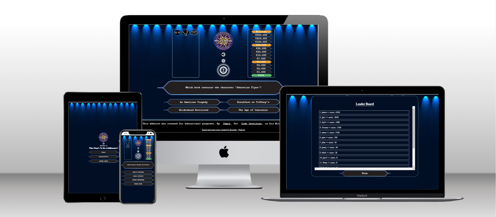

Welcome to, 

# Who Wants To Be A Millionaire

## Introduction

Welcome to the "Who Wants To Be A Millionaire" game! This is an interactive quiz game that replicates the famous TV show. The objective of the game is to correctly answer a series of increasingly difficult multiple-choice questions and progress towards winning one million (virtual) dollars!This game is made for educational purposes and will not be monatized...

The live link can be found here - https://jamie33o.github.io/Project2/ 

___

## Project Goals

The goals of this website include:

### Player Goals

- Play a fun and interactive online quiz game.
- Quickly understand how to play.
- Test their knowledge of multiple random catagories .
- Challenge themselves by answering a series of quiz questions.
- Play the game as often as desired with a easy "play again" option.
- Learn interesting facts and trivia.

### Site Owner Goals

- Create a fun interactive game that furthers my understanding of problem solving, through the use of code. From HTML, CCS to the JavaScript language.
- Create an attractive and easy to use website and user interface.
- Create a fully responsive game website.

[Back to Table of Contents](#table-of-contents)

___

## User Experience

### Target Audience

- The Who wants to be a millionaire game is perfect for fans of the famous show, and if you're a brainiac who craves exciting quiz challenges, this game is tailored for you. It's also an ideal choice for those who enjoy playing online quiz games. All you need is a web browser with JavaScript enabled on your device to embark on this thrilling journey of knowledge and entertainment.

### User Requirements and Expectations

- An intuitive navigation system regardless of screen size
- Easy to locate and understand game rules and instructions on how to play the game
- An intuitive game interface with clear controls and notifications to aid game play
- The ability to turn game Sound effects or Music on or off
- An easy way to register so you will be added to the leader board and add to your score each game
- An easy mechanism to Play Again.
- An accessible game website that can be viewed and played on any device

[Back to Table of Contents](#table-of-contents)

___

### User Stories

The players of the game are the primary users of this website with site owner being a secondary user:

#### Players

1.	As a player, I want the website to load quickly and provide a seamless and enjoyable quiz experience without any technical issues.
2.	As a player, I want to have a visually appealing and intuitive interface that makes it easy for me to understand and interact with the quiz.
3.	As a player, I want my score to be saved so I can compete with other Users.
4.	As a player, I want good design This includes themed background images and background music.
5.	As a player, I want the quiz questions to be challenging and engaging.
6.	As a player, I want to be able to view my score.
7.	As a player, I want to be able to see the correct answers for the questions I answered incorrectly to learn and improve my knowledge.
8.	As a quiz player, I want the option to play the quiz again without having to log in again.
9.	As a player, I want to be able to easily save the game when I reach a milestone so i can come back again and play from that milestone
10.	As a player, I want the game to have smooth and fluid animations and transitions, enhancing the overall visual appeal and user experience.
11.	As a player, I want the game to be optimized for different screen sizes and orientations, ensuring a seamless and enjoyable experience on both mobile and desktop devices.
12.	As a player, I want the game to have a visually appealing and intuitive user interface, with clear icons and labels, to easily understand and interact with the game controls.
13.	As a player, when I interact with buttons or elements in the game interface, I want to see appropriate effects, such as button clicks or hover effects. These effects will provide feedback and create a more engaging and responsive user experience.
14.	As a player, I want the sound effects to be enjoyable, non-intrusive, and harmonize with the overall game aesthetics, ensuring they enhance the gameplay experience without becoming distracting or annoying.
15.	As a who wants to be a millionaire enthusiast, I want to be able to play a Quiz to test my knowledge and have fun.
16.	As a player, I want the game to have a progress bar or indicator to track my progress during the quiz.

#### Site Owner

17. As the site owner, I want to receive feedback from players so I can understand if they are enjoying the game, identify any bugs, and continually improve the game.
18. As the site owner, I want users to see a 404 page if they enter an incorrect URL so they can be navigated back to the main game page.

[Back to Table of Contents](#table-of-contents)

___

