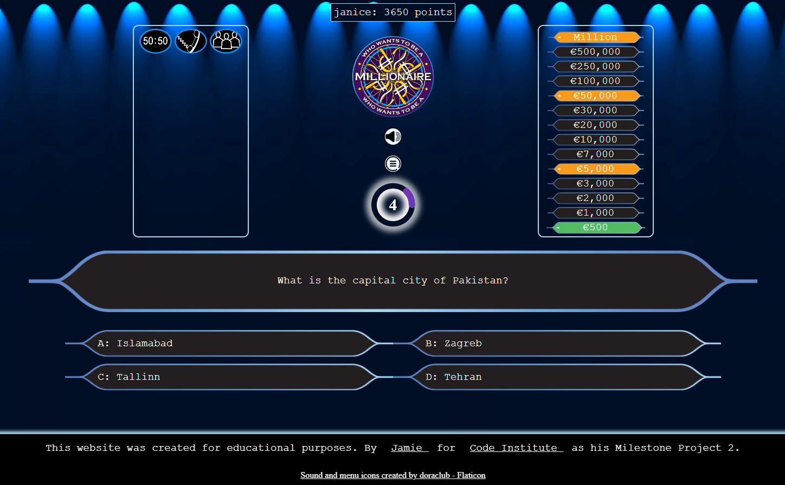
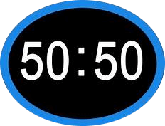

Welcome to, 

# Who Wants To Be A Millionaire

## Introduction

Welcome to the "Who Wants To Be A Millionaire" game! This is an interactive quiz game that replicates the famous TV show. The objective of the game is to correctly answer a series of increasingly difficult multiple-choice questions and progress towards winning one million (virtual) dollars!This game is made for educational purposes and will not be monatized...

The live link can be found here - https://jamie33o.github.io/Project2/ 

___

## Table of Contents

- [Who wants to be a millionaire](#quiz-game)
  - [Table of Contents](#table-of-contents)
  - [Project Goals](#project-goals)
    - [Player Goals](#player-goals)
    - [Site Owner Goals](#site-owner-goals)
  - [User Experience](#user-experience)
    - [Target Audience](#target-audience)
    - [User Requirements and Expectations](#user-requirements-and-expectations)
    - [User Stories](#user-stories)
      - [Players](#players)
      - [Site Owner](#site-owner)
- [Design](#design)
    - [Design Choices](#design-choices)
    - [Structure](#structure)
     - [Welcome Overlay menu Screen/Page](#welcome-Overlay-menu-Screen/Page)
      - [Register/Log in form](#register/Log-in-form)
      - [Instruction's](#instruction's)
      - [Leader Board](#leader-Board)
     - [Quiz Page](#quiz-Page)
      - [Life Lines box](#life-lines-box)
      - [Menu button](#menu-button)
      - [Timer](#timer)
      - [Prize's box](#prize's-box)
      - [Question and 4 answer boxs](#Question-and-4-answer-boxs)
      - [Footer](#Footer)
      

     - [Wireframes](#wireframes)
___

## Project Goals

The goals of this website include:

### Player Goals

- Play a fun and interactive online quiz game.
- Quickly understand how to play.
- Test their knowledge of multiple random catagories .
- Challenge themselves by answering a series of quiz questions.
- Play the game as often as desired with a easy "play again" option.
- Learn interesting facts and trivia.

### Site Owner Goals

- Create a fun interactive game that furthers my understanding of problem solving, through the use of code. From HTML, CCS to the JavaScript language.
- Create an attractive and easy to use website and user interface.
- Create a fully responsive game website.

[Back to Table of Contents](#table-of-contents)

___

## User Experience

### Target Audience

- The Who wants to be a millionaire game is perfect for fans of the famous show, and if you're a brainiac who craves exciting quiz challenges, this game is tailored for you. It's also an ideal choice for those who enjoy playing online quiz games. All you need is a web browser with JavaScript enabled on your device to embark on this thrilling journey of knowledge and entertainment.

### User Requirements and Expectations

- An intuitive navigation system regardless of screen size
- Easy to locate and understand game rules and instructions on how to play the game
- An intuitive game interface with clear controls and notifications to aid game play
- The ability to turn game Sound effects or Music on or off
- An easy way to register so you will be added to the leader board and add to your score each game
- An easy mechanism to Play Again.
- An accessible game website that can be viewed and played on any device

[Back to Table of Contents](#table-of-contents)

___

### User Stories

The players of the game are the primary users of this website with site owner being a secondary user:

#### Players

1.	As a player, I want the website to load quickly and provide a seamless and enjoyable quiz experience without any technical issues.
2.	As a player, I want to have a visually appealing and intuitive interface that makes it easy for me to understand and interact with the quiz.
3.	As a player, I want my score to be saved so I can compete with other Users.
4.	As a player, I want good design This includes themed background images and background music.
5.	As a player, I want the quiz questions to be challenging and engaging.
6.	As a player, I want to be able to view my score.
7.	As a player, I want to be able to see the correct answers for the questions I answered incorrectly to learn and improve my knowledge.
8.	As a quiz player, I want the option to play the quiz again without having to log in again.
9.	As a player, I want to be able to easily save the game when I reach a milestone so i can come back again and play from that milestone
10.	As a player, I want the game to have smooth and fluid animations and transitions, enhancing the overall visual appeal and user experience.
11.	As a player, I want the game to be optimized for different screen sizes and orientations, ensuring a seamless and enjoyable experience on both mobile and desktop devices.
12.	As a player, I want the game to have a visually appealing and intuitive user interface, with clear icons and labels, to easily understand and interact with the game controls.
13.	As a player, when I interact with buttons or elements in the game interface, I want to see appropriate effects, such as button clicks or hover effects. These effects will provide feedback and create a more engaging and responsive user experience.
14.	As a player, I want the sound effects to be enjoyable, non-intrusive, and harmonize with the overall game aesthetics, ensuring they enhance the gameplay experience without becoming distracting or annoying.
15.	As a who wants to be a millionaire enthusiast, I want to be able to play a Quiz to test my knowledge and have fun.
16.	As a player, I want the game to have a progress bar or indicator to track my progress during the quiz.

#### Site Owner

17. As the site owner, I want to receive feedback from players so I can understand if they are enjoying the game, identify any bugs, and continually improve the game.
18. As the site owner, I want users to see a 404 page if they enter an incorrect URL so they can be navigated back to the main game page.

[Back to Table of Contents](#table-of-contents)

___

## Design

### Design Choices

The aim of this site is to provide the look and feel similar to the tv show. With its dark blue colours with spotlights. All images, colours, and sounds were chosen with this aim in mind.

### Structure

The website consists of 3 pages (welcome overlay screen/page, quiz page, 404 error page).
The pages are structured in an easy-to-navigate framed pattern allowing visitors to quickly consume key information within the center of the screen. On the menu screen at the top center of the page the visitor will notice the quiz game logo, then followed under it is the mute/sound button then the start button then the instructions button and lastly the leader board button. 
This allows the user to quickly understand the name of the game, start the game, how to play, and how to toggle sound/music on or off.

#### Welcome Overlay menu Screen/Page

- The main game page, with a background consisting spot lights effect and gradient of light to dark blue also contains:
  - Register/Log in form
  - The Logo
  - Sound mute/unmute toggle icon.
  - An Instruction's button.
  - Leader board button to check user scores.

##### Register/Log in form

- A form that show's on the menu screen if the user is not logged in or has not registered.

##### Instruction's

- A simple scrollabale pop up, with a list on how to play the game in detail with a button at the bottom for the user to close the pop up.

##### Leader Board

- A simple scrollabale pop up, with a list of all the users scores starting at highest down to lowest with a "done" button at the bottom for the user to close the pop up.

___

#### Quiz Page

- The main game page, with a background consisting spot lights effect and gradient of light to dark blue also contains:
  - Life lines box 
  - The Logo
  - Sound mute/unmute toggle icon.
  - Menu button
  - Timer
  - Prize's box
  - Question and 4 answer boxs
  - Footer

##### Life Lines box
- The Life lines box has 3 life lines and when each button is pressed it will show the results inside the box under the buttons except for the 50:50 button as two answer will just dissapear:
 
 - 50:50 button: This button when pressed will make 2 wrong answers dissapear.

 - Ask the audience button: This button when pressed will show a bar chart to show the results of the audience votes with a letter on each bar to show which answer it represents the bars are animated so they rise slowly to there final position it does not always give the right answer.

 - Phone A friend button: This button when pressed will show a paragraph  of text representing the fake caller's anwers 

After each button is pressed and user goes to the next question a red x will be on the button to show it has been used.

##### Menu button

- The menu button is between the mute/sound button and the logo in the center of the page when pressed it shows the menu screen but it does not stop the timer so the user cant use it to pause the game and google the question.

##### Timer

- The timer is under the menu button in the center of the page it resets to 30 seconds for each question in the center is the number and then around it is a circle animation 

##### Prize's box

- The prize section is at the top right of the page it is a list that goes from €500 to €1 million , the question the user is on will be green and as the user gets annwers right the green background will move up the list of prizes, there is 3 milestone prizes "€5000" the score for this is 50points then €50,000 the score for this is 500points and €1 million the score for this is 1000points these are orange when the user reaches them there will be a pop up letting the user know they have reached a milestone and it will show the prize amount they are on and what score they get for it and there is two buttons on each pop up for the €500 and €50,000 there will be a "continue" button and a "save" button if the user clicks save they can leave the game and when they come back they will still be on that mile stone when the reach €1 million the pop will let the user know they have won and the buttons will ask if they would like to play again or quit

##### Question and 4 answer boxs

- The question and 4 answer's are displayed at the bottom of the page. When the user clicks an answer the user is instantly shown wether the question answer they selected was correct or wrong if correct they go to next question if it is wrong there is a pop up letting them know the game is over and it tells them the correct answer.

##### Footer

- The footer appears when the user scrolls to the bottom of the page and dissapears when they scroll up it contains 2 lines of text which are link

