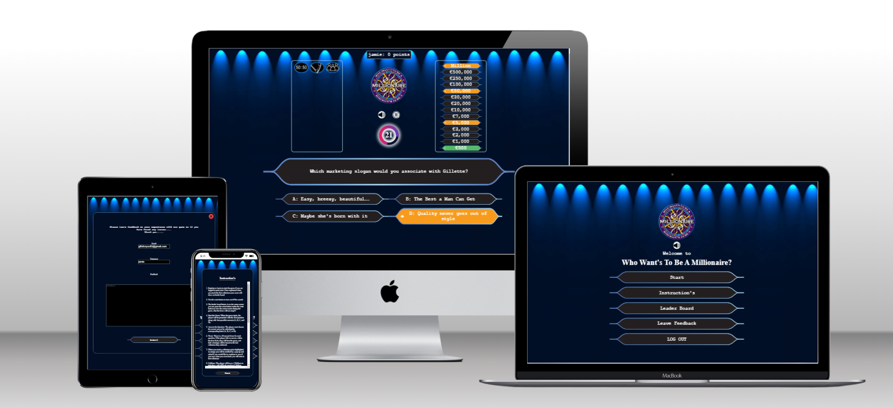
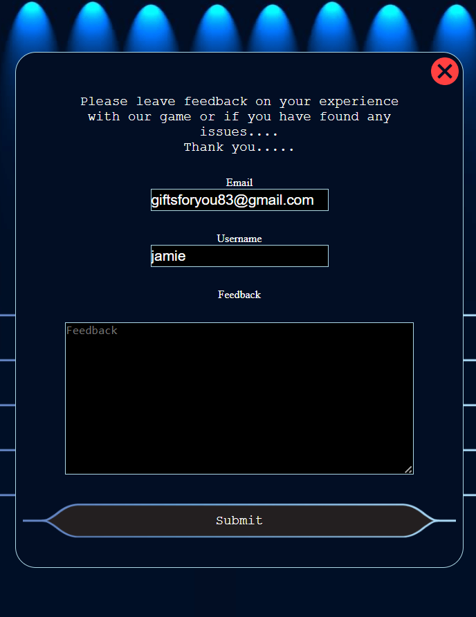
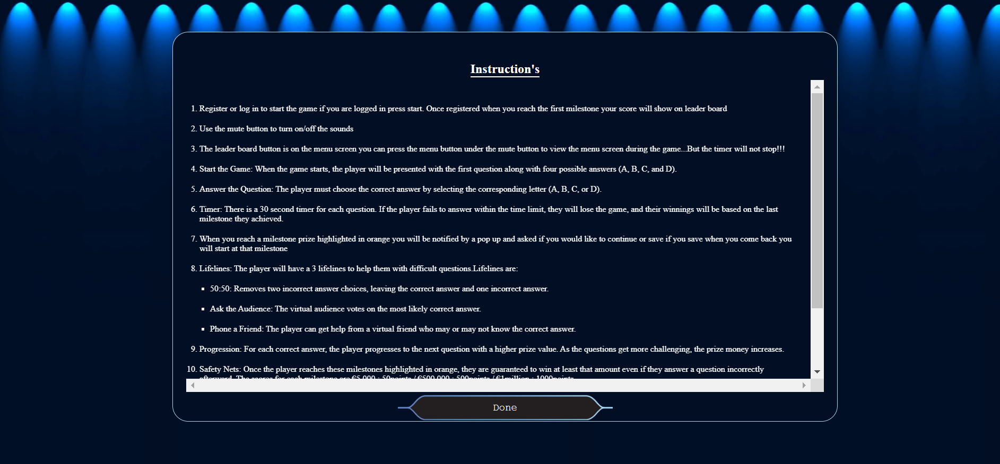
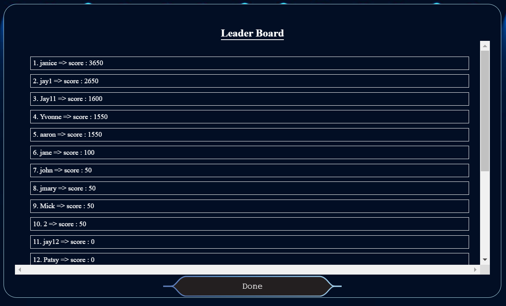

Welcome to, 

# Who Wants To Be A Millionaire

## Introduction

Welcome to the "Who Wants To Be A Millionaire" game! This interactive quiz game replicates the famous TV show. The objective is to correctly answer a series of increasingly difficult multiple-choice questions and progress towards winning one million (virtual) dollars! The game is designed for educational purposes and will not be monetized

The live link can be found here - https://jamie33o.github.io/Project2/ 

___

## Table of Contents

- [Project Goals](#project-goals)
  - [Player Goals](#player-goals)
  - [Site Owner Goals](#site-owner-goals)
- [User Experience](#user-experience)
  - [Target Audience](#target-audience)
  - [User Requirements and Expectations](#user-requirements-and-expectations)
  - [User Stories](#user-stories)
    - [Players](#players)
    - [Site Owner](#site-owner)
- [Design](#design)
  - [Design Choices](#design-choices)
  - [Wireframes](#wireframes)
- [Features](#features)
  - [Welcome Overlay Menu Screen/Page](#welcome-overlay-menu-screenpage)
    - [Register/Log in Form](#registerlog-in-form)
    - [Logo](#logo)
    - [Sound Mute/Unmute Toggle Icon](#sound-muteunmute-toggle-icon)
    - [Instructions Button](#instructions-button)
    - [Leaderboard Button](#leaderboard-button)
  - [Quiz Page](#quiz-page)
    - [Life Lines Box](#life-lines-box)
    - [Menu Button](#menu-button)
    - [Timer](#timer)
    - [Prizes Box](#prizes-box)
    - [Question and 4 Answer Boxes](#question-and-4-answer-boxes)
    - [Footer](#footer)
- [Technologies](#technologies)
- [Testing](#testing)
  - [Responsiveness](#responsiveness)
  - [Validator Testing](#validator-testing)
  - [Accessibility](#accessibility)
  - [Lighthouse Testing](#lighthouse-testing)
  - [Functional Testing](#functional-testing)
  - [Unfixed Bugs](#unfixed-bugs)
- [Deployment](#deployment)
- [Credits](#credits)
      

     - [Wireframes](#wireframes)
___

## Project Goals

The goals of this website include:

- __Player Goals__

  - Play a fun and interactive online quiz game.
  - Quickly understand how to play.
  - Test their knowledge of multiple random catagories .
  - Challenge themselves by answering a series of quiz questions.
  - Play the game as often as desired with a easy "play again" option.
  - Learn interesting facts and trivia.

- __Site Owner Goals__

  - Create a fun interactive game that furthers my understanding of problem solving, through the use of code. From HTML, CCS to the JavaScript language.
  - Create an attractive and easy to use website and user interface.
  - Create a fully responsive game website.

  [Back to Table of Contents](#table-of-contents)

___

## User Experience

- __Target Audience__

  - The Who wants to be a millionaire game is perfect for fans of the famous show, and if you're a brainiac who craves exciting quiz challenges, this game is tailored for you. It's also an ideal choice for those who enjoy playing online quiz games. All you need is a web browser with JavaScript enabled on your device to embark on this thrilling journey of knowledge and entertainment.

- __User Requirements and Expectations__

  - An intuitive navigation system regardless of screen size
  - Easy to locate and understand game rules and instructions on how to play the game
  - An intuitive game interface with clear controls and notifications to aid game play
  - The ability to turn game Sound effects or Music on or off
  - An easy way to register so you will be added to the leader board and add to your score each game
  - An easy mechanism to Play Again.
  - An accessible game website that can be viewed and played on any device

  [Back to Table of Contents](#table-of-contents)

___

- __User Stories__

  - The players of the game are the primary users of this website with site owner being a secondary user:

 - __Players__

1.	As a player, I want the website to load quickly and provide a seamless and enjoyable quiz experience without any technical issues.
2.	As a player, I want to have a visually appealing and intuitive interface that makes it easy for me to understand and interact with the quiz.
3.	As a player, I want my score to be saved so I can compete with other Users.
4.	As a player, I want good design This includes themed background images and background music.
5.	As a player, I want the quiz questions to be challenging and engaging.
6.	As a player, I want to be able to view my score.
7.	As a player, I want to be able to see the correct answers for the questions I answered incorrectly to learn and improve my knowledge.
8.	As a quiz player, I want the option to play the quiz again without having to log in again.
9.	As a player, I want to be able to easily save the game when I reach a milestone so i can come back again and play from that milestone
10.	As a player, I want the game to have smooth and fluid animations and transitions, enhancing the overall visual appeal and user experience.
11.	As a player, I want the game to be optimized for different screen sizes and orientations, ensuring a seamless and enjoyable experience on both mobile and desktop devices.
12.	As a player, I want the game to have a visually appealing and intuitive user interface, with clear icons and labels, to easily understand and interact with the game controls.
13.	As a player, when I interact with buttons or elements in the game interface, I want to see appropriate effects, such as button clicks or hover effects. These effects will provide feedback and create a more engaging and responsive user experience.
14.	As a player, I want the sound effects to be enjoyable, non-intrusive, and harmonize with the overall game aesthetics, ensuring they enhance the gameplay experience without becoming distracting or annoying.
15.	As a who wants to be a millionaire enthusiast, I want to be able to play a Quiz to test my knowledge and have fun.
16.	As a player, I want the game to have a progress bar or indicator to track my progress during the quiz.

- __Site Owner__

17. As the site owner, I want to receive feedback from players so I can understand if they are enjoying the game, identify any bugs, and continually improve the game.
18. As the site owner, I want users to see a 404 page if they enter an incorrect URL so they can be navigated back to the main game page.

[Back to Table of Contents](#table-of-contents)

___

## Design

- __Design Choices__

The aim of this site is to provide the look and feel similar to the tv show. With its dark blue colours with spotlights. All images, colours, and sounds were chosen with this aim in mind.

- __Wireframes__

Homepage
___

## Features

The website comprises three pages: a welcome overlay screen/page, a quiz page, and a 404 error page. These pages follow a user-friendly and easily navigable framed pattern, enabling visitors to swiftly access key information at the center of the screen. 

On the menu screen, located at the top center of the page, visitors will immediately notice the quiz game logo. Positioned below the logo are the mute/sound button, the start button, the instructions button, and finally, the leader board button. This intuitive layout ensures that users can quickly grasp the name of the game, commence playing, understand the gameplay instructions, and conveniently toggle sound or music on or off.

### Existing Features

#### Welcome Overlay menu Screen/Page
  

- On the main game page, you will be greeted with a captivating background featuring spotlight effects and a gradient of light to dark blue. The following essential elements are also present on this page:
  
- Register/Log in form

  - Register/Log in Form: Users can easily access the registration and login form, allowing them to participate in the game and keep track of their progress.
  

- Logo

  - The Logo: The game's logo is prominently displayed, giving users a clear visual identity of the game they are engaging with.

- Sound mute/unmute toggle icon

  - Sound Mute/Unmute Toggle Icon: Users have the option to control the sound by toggling between mute and unmute, ensuring a customizable audio experience.

  

- Instruction's

  - Instructions Button: For newcomers or those needing a refresher, an "Instructions" button is readily available. Clicking on it will provide clear guidelines on how to play the game.

  

- Leader Board

  - Leaderboard Button: To encourage competitiveness and track user scores, a "Leaderboard" button is provided. Players can check their standings among others who have participated in the game.

  

___

#### Quiz Page

- On the main game page, you will find an engaging background featuring spotlight effects and a gradient from light to dark blue. The page includes the following key elements:
  

- Life Lines box

  - The Life lines box has 3 life lines and when each button is pressed it will show the results inside the box under the buttons except for the 50:50 button as two answer will just dissapear:

  - 50:50 button: This button when pressed will make 2 wrong answers dissapear.
  
    

  - Ask the audience button: This button when pressed will show a bar chart to show the results of the audience votes with a letter on each bar to show which answer it represents the bars are animated so they rise slowly to there final position it does not always give the right answer.
    
  - Phone A friend button: This button when pressed will show a paragraph  of text representing the fake caller's anwers 
    

  - After each button is pressed and user goes to the next question a red x will be on the button to show it has been used.
    

- Menu button

  - The menu button is between the mute/sound button and the logo in the center of the page when pressed it shows the menu screen but it does not stop the timer so the user cant use it to pause the game and google the question.
  

- Timer

  - On the main game page, you'll find the timer positioned below the menu button in the center of the screen. The timer is set to 30 seconds for each question and is represented as a numerical countdown in the center. Encircling the timer, there is a dynamic circle animation that visually illustrates the remaining time, gradually shrinking as the seconds pass. This animation adds excitement and urgency to the game, prompting users to make quick decisions during their gameplay. 
  

- Prize's box

  - On the main game page, the prize section is located at the top right corner, presented as a list ranging from €500 to €1 million. As the user progresses through the game and answers questions correctly, the corresponding prize amount will be highlighted with a green background, indicating the current level they are on.
  

- There are three milestone prizes that hold special significance in the game:

  - €5,000 Milestone: The user reaches this milestone when they score 50 points. Upon reaching this milestone, the prize amount will be highlighted in orange.

  - €50,000 Milestone: When the user achieves 500 points, they will hit this milestone, and the prize amount will be displayed in orange.

  - €1 Million Milestone: Reaching the ultimate goal of 1000 points will unlock the €1 million prize, also indicated with an orange background.

-  When the user reaches any of these milestone prizes, a pop-up notification will appear, congratulating them on their achievement. The pop-up will display the prize amount they are currently on and the score they have obtained. For the €500 and €50,000 milestones, two buttons will be available:

- "Continue" button: If the user clicks this button, they can proceed with the game and continue playing from the current milestone.

- "Save" button: By clicking this button, the user can choose to exit the game, and their progress will be saved at the current milestone. When they return to the game, they will resume from where they left off.

- Upon reaching the €1 million milestone, a special pop-up will appear, announcing the user's victory in winning the grand prize. The pop-up will provide two options:

- "Play Again" button: If the user wants to play again and aim for higher scores, they can click this button and restart the game.

- "Quit" button: Clicking this button will allow the user to gracefully exit the game after their triumph.

These features and notifications enhance the excitement and engagement of the game while providing the user with clear feedback on their progress and achievements.

- Question and 4 answer boxs

  - On the main game page, the question and four answer choices are displayed at the bottom of the screen. When the user selects an answer by clicking on it, they will instantly receive feedback on whether their choice was correct or incorrect.

  - If the user's answer is correct:

    - They will be notified immediately that their answer is correct.
    - The game will automatically proceed to the next question, presenting them with another opportunity to answer and continue their progress.

  - If the user's answer is wrong:

    - A pop-up notification will appear, informing them that the game is over for this session.
    - The pop-up will reveal the correct answer to the question they just attempted.
    - This swift feedback system allows users to quickly know their performance, learn from their mistakes, and continue playing or start a new game with improved knowledge. It keeps the gameplay engaging and encourages users to challenge themselves to achieve better results in subsequent attempts.
    
    

- Footer

  - On the main game page, the footer is designed to appear when the user scrolls to the bottom of the page, and it will automatically disappear when they scroll back up. The footer contains text, serving as a link to relevant information and resources.
  

## Technologies

- HTML
  - The structure of the Website was developed using HTML as the main language.
- CSS
  - The Website was styled using custom CSS in an external file.
- Javascript
  - Building, structuring and presenting project
- Back4app parse database
  - Storing user log in details and score also displaying sore on the leader board
- Visual Studio Code
  - The website was developed using Visual Studio Code IDE
- GitHub
  - Source code is hosted on GitHub and delpoyed using Git Pages.
- Git
  - Used to commit and push code during the development opf the Website
- Flaticon
  - Sound and menu icons created by doraclub - Flaticon section.
- Tinyjpg
  - https://tinyjpg.com/ was used to reduce the size of the images used throughout the website
- Favicon.io
  - favicon files were created at [favicon.io](fahttps://favicon.io/favicon-converter/)
- balsamiq
  - wireframes were created using balsamiq from [balsamiq.com](https://balsamiq.com/wireframes/desktop/#)

## Testing 

### Responsiveness

All pages were tested to ensure responsiveness on screen sizes from 320px and upwards as defined in [WCAG 2.1 Reflow criteria for responsive design](https://www.w3.org/WAI/WCAG21/Understanding/reflow.html) on Chrome, Edge, Firefox and Opera browsers.

Steps to test:

1. Open browser and navigate to [Who wants to be a millionaire](https://jamie33o.github.io/Project2/ )
2. Open the developer tools (right click and inspect)
3. Set to responsive and decrease width to 320px
4. Set the zoom to 50%
5. Click and drag the responsive window to maximum width
6. Expected:

Website is responsive on all screen sizes and no images are pixelated or stretched. No horizontal scroll is present. No elements overlap.

Actual:

Website behaved as expected with the exception of some images been to large at 320px.

Website was also opened on the following devices and no responsive issues were seen:

Oukitel C21 Pro
TCL 30 Pro
iPhone SE
Samsung Galaxy Tablet

### Validator Testing 

- HTML
  - No errors were returned when passing through the official [W3C validator](https://validator.w3.org/nu/?doc=https%3A%2F%2Fjamie33o.github.io%2Fhistory-of-michael-collins%2F)
- CSS
  - No errors were found when passing through the official [(Jigsaw) validator](http://jigsaw.w3.org/css-validator/validator?lang=en&profile=css3svg&uri=https%3A%2F%2Fjamie33o.github.io%2Fhistory-of-michael-collins%2F&usermedium=all&vextwarning=&warning=1)

### Accessibility

[Wave Accessibility](https://wave.webaim.org/) tool was used throughout development and for final testing of the deployed website to check for any aid accessibility testing.

Testing was focused to ensure the following criteria were met:

All forms have associated labels so that this is read out on a screen reader to users
Color contrasts meet a minimum ratio as specified in WCAG 2.1 Contrast Guidelines
Heading levels are not missed or skipped to ensure the importance of content is relayed correctly to the end user
All content is contained within landmarks to ensure ease of use for assistive technology, allowing the user to navigate by page regions
All not textual content had alternative text or titles so descriptions are read out to screen readers
HTML page lang attribute has been set
Aria properties have been implemented correctly
WCAG 2.1 Coding best practices being followed

Manual tests were also performed to ensure the website was accessible as possible and an accessibility issue was identified.

